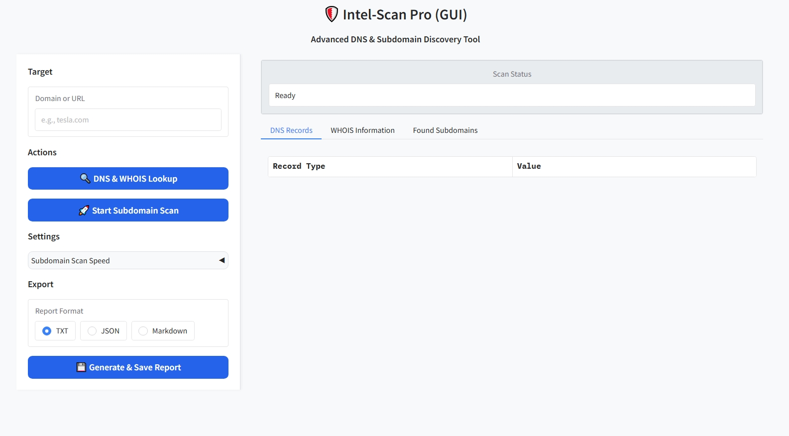
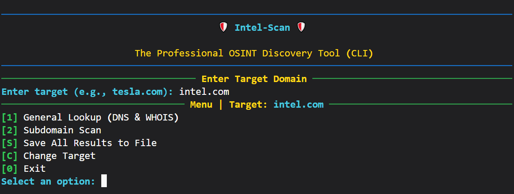

<div align="center">
  
  <h1>Intel-Scan</h1>
  <strong>Built by Muhammad Izaz Haider</strong>
  <p>From a lightning-fast CLI to an intuitive GUI, Intel-Scan is a complete reconnaissance solution built for modern cybersecurity professionals.</p>

<p>
    <a href="https://github.com/mizazhaider-ceh/Intel-Scan/stargazers"></a>
    <a href="https://github.com/mizazhaider-ceh/Intel-Scan/blob/main/LICENSE"></a>
    <a href="https://github.com/mizazhaider-ceh/Intel-Scan/issues"></a>
    <a href="https://www.python.org/"></a>
  </p>
</div>

---

## 📖 Table of Contents

- [The Vision: More Than Just a Tool](#-the-vision-more-than-just-a-tool)
- [Core Features](#-core-features)
- [The Dual-Interface Philosophy](#-the-dual-interface-philosophy)
  - [The Graphical User Interface (GUI)](#-the-graphical-user-interface-gui)
  - [The Command-Line Interface (CLI)](#-the-command-line-interface-cli)
- [Technical Deep Dive](#-technical-deep-dive)
  - [Project Architecture](#-project-architecture)
  - [Technology Stack](#-technology-stack)
- [Installation &amp; Setup Guide](#-installation--setup-guide)
- [Usage Instructions](#-usage-instructions)
- [Contributing to the Project](#-contributing-to-the-project)
- [License](#-license)
- [About the Author](#-about-the-author)

---

## 🎯 The Vision: More Than Just a Tool

In the world of cybersecurity, reconnaissance is the critical first step. Yet, analysts often find themselves juggling multiple terminals, running separate scripts for DNS, WHOIS, and subdomain enumeration. The process is fragmented and inefficient.

**Intel-Scan was born from a simple vision:** to unify these essential OSINT tasks into a single, cohesive, and elegant framework.

This project began as a powerful **Command-Line Interface (CLI)**, optimized for speed and automation. But true power lies in accessibility. It then evolved, incorporating a full-featured **Graphical User Interface (GUI)** to make its robust engine available to everyone ... from seasoned pentesters to security analysts preparing client reports. This dual-interface approach ensures that no matter your workflow, Intel-Scan has you covered.

## ✨ Core Features

| Feature                                       | Description                                                                                                                                      | Availability      |
| :-------------------------------------------- | :----------------------------------------------------------------------------------------------------------------------------------------------- | :---------------- |
| **Comprehensive DNS Lookup**            | Fetches A, AAAA, MX, TXT, NS, SOA, and CNAME records, providing a complete picture of a domain's DNS posture.                                    | `CLI` & `GUI` |
| **Detailed WHOIS Reports**              | Retrieves and parses extensive WHOIS information, including registrar details, creation/expiry dates, and full raw data.                         | `CLI` & `GUI` |
| **High-Performance Subdomain Scanning** | Utilizes multithreading to rapidly discover thousands of active subdomains from a curated wordlist.                                              | `CLI` & `GUI` |
| **Selectable Scan Speeds**              | Choose between Normal (50), Fast (100), and Insane (200) thread counts to balance speed with network stability.                                  | `CLI` & `GUI` |
| **Interactive CLI Menu**                | A persistent,`rich`-powered terminal menu allows for continuous scanning without restarting the tool.                                          | `CLI`           |
| **Visual Dashboard UI**                 | An intuitive `gradio`-powered web interface for easy, point-and-click analysis.                                                                | `GUI`           |
| **Multi-Format Reporting**              | Export complete scan results as**TXT**, **JSON**, **Markdown** directly from the GUI for easy integration into your workflow. | `GUI`           |

---

## 🚀 The Dual-Interface Philosophy

Intel-Scan is built on the belief that a great tool should adapt to the user, not the other way around.

### 🌐 The Graphical User Interface (GUI)

The GUI is the heart of visual analysis in Intel-Scan. It's designed for clarity, ease of use, and comprehensive reporting, making it perfect for in-depth investigations and preparing client-facing deliverables.

<div align="center">
  
</div>

### ⌨️ The Command-Line Interface (CLI)

The CLI is where it all began. It's built for speed, efficiency, and automation. For the power user who lives in the terminal, the CLI provides direct access to the scanning engine with a clean, interactive menu system powered by the `rich` library.

<div align="center">
  
</div>

```
$ python intelscan_cli.py

🛡️ Intel-Scan 🛡️
The Professional OSINT Discovery Tool (CLI)
--------------------------------------------------
Menu | Target: tesla.com
--------------------------------------------------
[1] General Lookup (DNS & WHOIS)
[2] Subdomain Scan
[S] Save All Results to File
[C] Change Target
[0] Exit
Select an option:
```

---

## 🛠️ Technical Deep Dive

This project was built with professional software architecture principles to ensure it is maintainable, scalable, and efficient.

### Project Architecture

The application follows the **DRY (Don't Repeat Yourself)** principle by separating the core logic from the user interfaces. This ensures that any bug fix or improvement to the scanning engine is immediately available to both the CLI and GUI.

```
Intel-Scan/
├── intel_scan_core/    # (The Engine) Shared logic for scanning, parsing, and reporting.
│   ├── __init__.py     # Makes this directory a Python package.
│   └── logic.py        # Contains all backend functions.
│
├── data/               # Contains data files, like wordlists for scanning.
│
├── intelscan_cli.py    # (Interface 1) The command-line interface.
├── intelscan_gui.py    # (Interface 2) The graphical user interface.
│
├── requirements.txt    # A list of all Python dependencies for easy installation.
└── README.md           # You are here!
```

### Technology Stack

- **Backend & Core Logic:** Python 3
- **CLI:** [Rich](https://github.com/Textualize/rich) for beautiful terminal UIs & [Typer](https://github.com/tiangolo/typer) (implicitly, via CLI structure).
- **GUI:** [Gradio](https://github.com/gradio-app/gradio) for rapid web UI development.
- **Core Libraries:** `dnspython`, `python-whois`, `pandas`.

---

## ⚙️ Installation & Setup Guide

Get Intel-Scan running in minutes.

### Step 1: Clone the Repository

```bash
git clone https://github.com/mizazhaider-ceh/Intel-Scan.git
cd Intel-Scan
```

### Step 2: Set Up a Virtual Environment (Highly Recommended)

This isolates the project's dependencies and avoids conflicts.

```bash
# On Windows:
python -m venv venv && .\venv\Scripts\activate

# On macOS/Linux:
python3 -m venv venv && source venv/bin/activate
```

### Step 3: Install All Dependencies

This command reads the `requirements.txt` file and installs every library needed for both the CLI and GUI.

```bash
pip install -r requirements.txt
```

### Step 4: Add Your Data

- For subdomain scanning to work, place your wordlist file (e.g., `common_subdomains.txt`) inside the `data/wordlists/` directory.

---

## 🕹️ Usage Instructions

You can run Intel-Scan in two different modes.

#### To Launch the GUI:

```bash
python intelscan_gui.py
```

> Open the local URL (e.g., `http://127.0.0.1:7860`) provided in your terminal in any web browser.

#### To Launch the CLI:

```bash
python intelscan_cli.py
```

> The interactive menu will launch directly in your terminal.

---

## 🤝 Contributing to the Project

This is an open-source project, and contributions are welcome! Whether it's a bug fix, a feature request, or a new module, feel free to get involved.

1. **Fork** the repository.
2. Create your **Feature Branch** (`git checkout -b feature/NewScanner`).
3. **Commit** your changes (`git commit -m 'Add NewScanner module'`).
4. **Push** to the branch (`git push origin feature/NewScanner`).
5. Open a **Pull Request**.

Please check the [issues page](https://github.com/mizazhaider-ceh/Intel-Scan/issues) for ideas on what to work on.

## 📄 License

This project is distributed under the MIT License. See the `LICENSE` file for more information.

## 👨‍💻 About the Author

**Muhammad Izaz Haider**

A passionate cybersecurity professional focused on Offensive Security , Ai in Cybersecurity and building high-impact, practical security tools that bridge the gap between complex tasks and elegant user experiences.

- **LinkedIn:** [Connect with me!](https://www.linkedin.com/in/mizazhaider-ceh/)
- **GitHub:** [View my other projects](https://github.com/mizazhaider-ceh)
