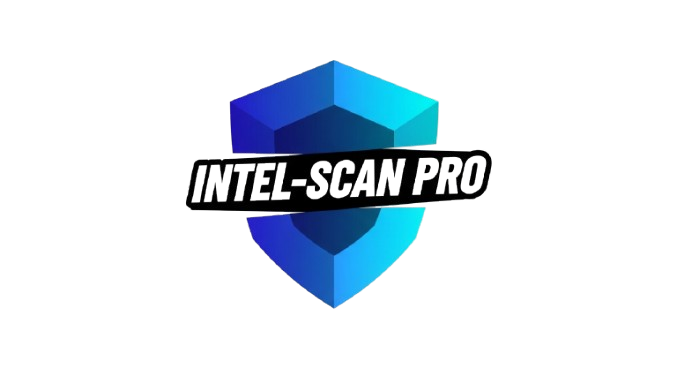
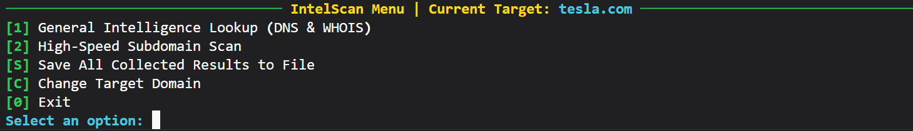

# 🔥 Intel-Scan: The Ultimate Reconnaissance Framework 🕵️‍♂️

<p align="center">
  
</p>

> **Intel-Scan** is an elegant, powerful, and blazing-fast reconnaissance tool for cybersecurity professionals and ethical hackers. It provides a comprehensive suite of intelligence-gathering modules within a beautiful and interactive terminal UI, powered by the Rich library.
>
> 
> 
> 
> [](https://www.linkedin.com/in/muhammad-izaz-haider-091639314/)

---



## ✨ Key Features

* **🌐 Comprehensive DNS Enumeration:** **Fetches all critical DNS records (**A**,** **AAAA**, **MX**, **TXT**, **NS**, **SOA**, **CNAME**).
* **👤 Detailed WHOIS Lookups:** **Retrieves extensive WHOIS information, including registrar details, creation dates, and contact information.**
* **⚡** **High-Performance Subdomain Scanning:**

  * **Brute-forces over** **35,000+ potential subdomains** **using a curated, high-quality wordlist.**
  * **Features user-selectable speed tiers:** **Normal (50 threads), Fast (100 threads), and Insane (150 threads)** **to match your needs and network conditions.**
* **📈 Advanced Interactive Framework:** **A persistent menu allows you to run different scans, change targets, and save results without ever restarting the tool.**
* **💾 Centralized Reporting:** **Compiles all collected intelligence (DNS, WHOIS, Subdomains) into a single, clean, and timestamped report for easy analysis.**

## 🚀 Live Demo

- **Watch On Linkedin:**        [Watch]([https://mizazhaider-ceh.github.io/My-Portfolio/](https://www.linkedin.com/posts/muhammad-izaz-haider-091639314_alhamdulillah-built-%F0%9D%97%9C%F0%9D%97%BB%F0%9D%98%81%F0%9D%97%B2%F0%9D%97%B9-%F0%9D%97%A6%F0%9D%97%B0%F0%9D%97%AE%F0%9D%97%BB-activity-7354369778259550208-SZ8X?utm_source=share&utm_medium=member_desktop&rcm=ACoAAE_T-C0BSzkVPAgz4Tm4DP5NBcgGPmL8Jhw)

## 🛠️ Installation & Setup

**1. Clone the repository:**

```bash
git clone https://github.com/your-username/Intel-Scan.git
cd Intel-Scan
```

**2. Create a virtual environment (recommended):**

```bash
# Windows
python -m venv venv
.\venv\Scripts\activate

# macOS/Linux
python3 -m venv venv
source venv/bin/activate
```

**3. Install dependencies:**

```bash
pip install -r requirements.txt
```

**4. Verify Directory Structure:**

```
Intel-Scan/
│
├── data/
│   └── wordlists/
│       └── common_subdomains.txt
├── results/
│   └── (Reports will be saved here)
├── intel-scan.py
├── requirements.txt
└── README.md
```

> The `common_subdomains.txt` file is essential for subdomain scanning.

## 🖥️ Usage

To launch the tool:

```bash
python intel-scan.py
```

**Interactive Menu Options:**



- **[1] General Intelligence Lookup:** DNS and WHOIS scans.
- **[2] High-Speed Subdomain Scan:** Multi-threaded subdomain enumeration.
- **[S] Save All Collected Results:** Save all gathered data for the current target.
- **[C] Change Target Domain:** Switch to a new target without exiting.
- **[0] Exit:** Gracefully exit the application.

## 🏆 Why You'll Love It

- **Instant Results:** No more waiting—get the data you need, when you need it.
- **Zero Learning Curve:** Clean, intuitive interface—start scanning in seconds.
- **Professional Reports:** Impress clients and teammates with clean, organized output.
- **Open Source:** Fork, extend, and contribute—let’s make recon better together!

## 🤝 Contributing

Contributions, issues, and feature requests are welcome!
Check the [issues page](https://github.com/your-username/Intel-Scan/issues).

**How to contribute:**

1. Fork the project
2. Create your feature branch (`git checkout -b feature/AmazingFeature`)
3. Commit your changes (`git commit -m 'Add some AmazingFeature'`)
4. Push to the branch (`git push origin feature/AmazingFeature`)
5. Open a pull request

## 📄 License

This project is licensed under the MIT License. See the [LICENSE](LICENSE) file for details.

## 👨‍💻 About the Author

**Muhammad Izaz Haider**

Passionate, self-taught cybersecurity professional focused on Offensive Security, AI in Cybersecurity, and building practical, high-impact security tools.

- **LinkedIn:**        [Connect](https://www.linkedin.com/in/muhammad-izaz-haider-091639314/)
- **Portfolio:**        [View](https://mizazhaider-ceh.github.io/My-Portfolio/)

> **Intel-Scan**: Because real hackers deserve real tools.

---
